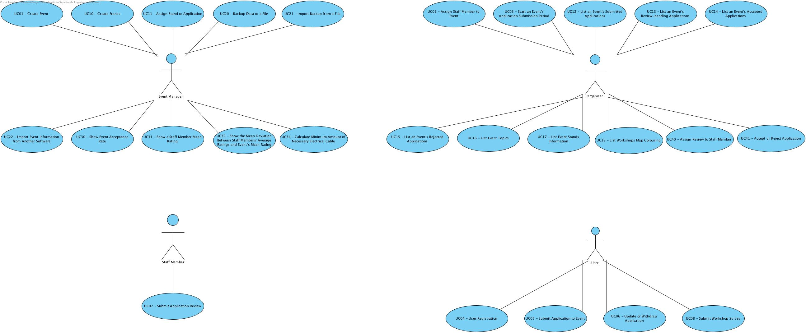

# **LAPR2 Project**

## **Requirements Engineering**

| **UC** | **Description** |
|--------|-----------------|
| UC01   | [Create Event](RequirementsEngineering/UC01-CreateEvent/UC01-CreateEvent.md) |
| UC02   | [Assign Staff Member to Event](RequirementsEngineering/UC02-AssignStaffMemberToEvent/UC02-AssignStaffMemberToEvent.md) |
| UC03   | [Start an Event's Application Submission Period](RequirementsEngineering/UC03-StartAnEventsApplicationSubmissionPeriod/UC03-StartAnEventsApplicationSubmissionPeriod.md) |
| UC04   | [User Registration](RequirementsEngineering/UC04-UserRegistration/UC04-UserRegistration.md) |
| UC05   | [Submit Application to Event](RequirementsEngineering/UC05-SubmitApplicationToEvent/UC05-SubmitApplicationToEvent.md) |
| UC06   | [Update or Withdraw Application](RequirementsEngineering/UC06-UpdateOrWithdrawApplication/UC06-UpdateOrWithdrawApplication.md) |
| UC07   | [Submit Application Review](RequirementsEngineering/UC07-SubmitApplicationReview/UC07-SubmitApplicationReview.md) |
| UC08   | [Submit Workshop Survey](RequirementsEngineering/UC08-SubmitWorkshopSurvey/UC08-SubmitWorkshopSurvey.md) |
| UC10   | [Create Stands](RequirementsEngineering/UC10-CreateStands/UC10-CreateStands.md) |
| UC11   | [Assign Stand to Application](RequirementsEngineering/UC11-AssignStandToApplication/UC11-AssignStandToApplication.md) |
| UC12   | [List an Event's Submitted Applications](RequirementsEngineering/UC12-ListAnEventsSubmittedApplications/UC12-ListAnEventsSubmittedApplications.md) |
| UC13   | [List an Event's Review-Pending Applications](RequirementsEngineering/UC13-ListAnEventsReviewPendingApplications/UC13-ListAnEventsReviewPendingApplications.md) |
| UC14   | [List an Event's Accepted Applications](RequirementsEngineering/UC14-ListAnEventsAcceptedApplications/UC14-ListAnEventsAcceptedApplications.md) |
| UC15   | [List an Event's Rejected Applications](RequirementsEngineering/UC15-ListAnEventsRejectedApplications/UC15-ListAnEventsRejectedApplications.md) |
| UC16   | [List Event Topics](RequirementsEngineering/UC16-ListEventTopics/UC16-ListEventTopics.md) |
| UC17   | [List Event Stands Information](RequirementsEngineering/UC17-ListEventStandsInformation/UC17-ListEventStandsInformation.md) |
| UC20   | [Backup Data to a File](RequirementsEngineering/UC20-BackupDataToAFile/UC20-BackupDataToAFile.md) |
| UC21   | [Import Backup from a File](RequirementsEngineering/UC21-ImportBackupFromAFile/UC21-ImportBackupFromAFile.md) |
| UC22   | [Import Event Information from Another Software](RequirementsEngineering/UC22-ImportEventInformationFromAnotherSoftware/UC22-ImportEventInformationFromAnotherSoftware.md) |
| UC30   | [Show Event Acceptance Rate](RequirementsEngineering/UC30-ShowEventAcceptanceRate/UC30-ShowEventAcceptanceRate.md) |
| UC31   | [Show a Staff Member Mean Rating](RequirementsEngineering/UC31-ShowAStaffMemberMeanRating/UC31-ShowAStaffMemberMeanRating.md) |
| UC32   | [Show the Mean Deviation Between Staff Members' Average Ratings and Events Mean Rating](RequirementsEngineering/UC32-ShowTheMeanDeviationBetweenStaffMembersAverageRatingsAndEventsMeanRating/UC32-ShowTheMeanDeviationBetweenStaffMembersAverageRatingsAndEventsMeanRating.md) |
| UC33   | [List Workshops Map Colouring](RequirementsEngineering/UC33-ListWorkshopsMapColouring/UC33-ListWorkshopsMapColouring.md) |
| UC34   | [Calculate Minimum Amount of Necessary Electrical Cable](RequirementsEngineering/UC34-CalculateMinimumAmountOfNecessaryElectricalCable/UC34-CalculateMinimumAmountOfNecessaryElectricalCable.md) |
| UC40   | [Assign Review to Staff Member](RequirementsEngineering/UC40-AssignReviewToStaffMember/UC40-AssignReviewToStaffMember.md) |
| UC41   | [Accept or Reject Application](RequirementsEngineering/UC41-AcceptOrRejectApplication/UC41-AcceptOrRejectApplication.md) |

## **Domain Model**

## **Use Case Diagram**

