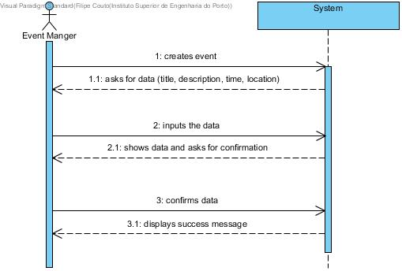
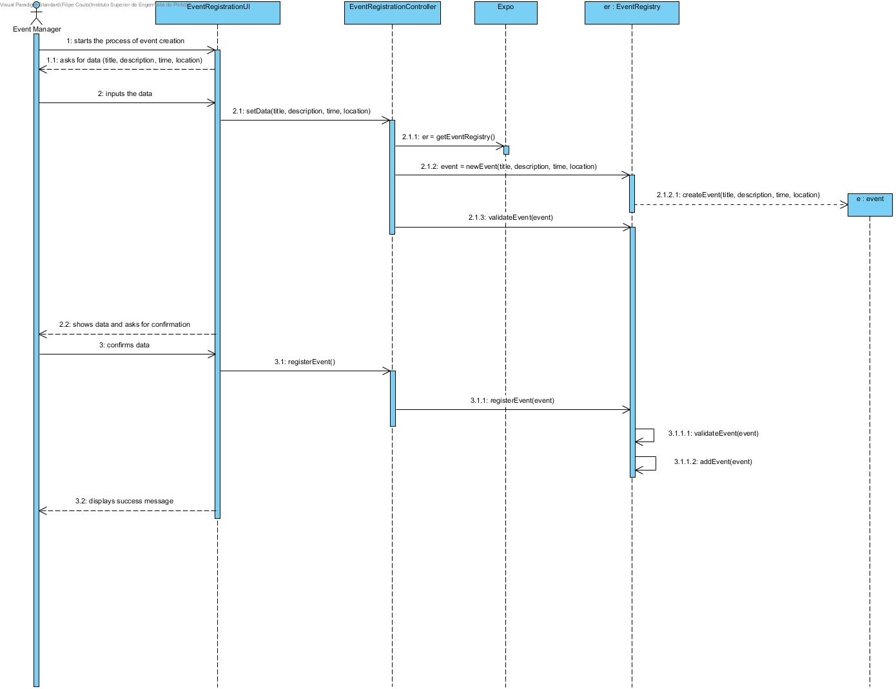
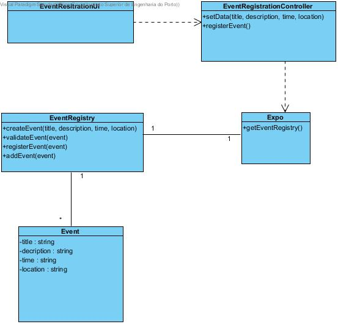

# **UC01 Create Event**

## **1. Analysis**

### Brief Description

The event manager creates an event by specifying its title, a descriptive text about its scope, the time and place of the event and the group of people (organisers) responsible for carrying out the exhibition process.

### Main Actor

Event Manager

### System Sequence Diagram (SSD)

## **2. Design**

### Sequence Diagram

### Class Diagram

