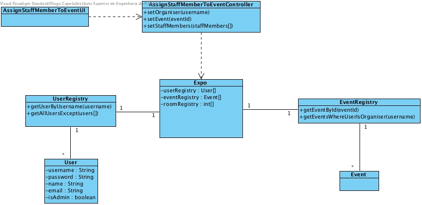

# **UC02 Assign Staff Member to Event**

## **1. Analysis**

### Brief Description

At a later stage, any organiser may specify which employees (staff) will support the event. The organiser initialises the process of assigning staff members to an event. The system will list all the events that the current user is an organiser. The system will list all the available users that are not already assigned as staff members for the current event and the organiser will select the ones that he wants to assign as staff.

### Main Actor

Organiser

### System Sequence Diagram (SSD)

## **2. Design**

### Sequence Diagram

### Class Diagram

