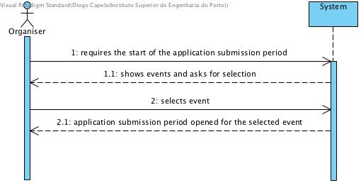
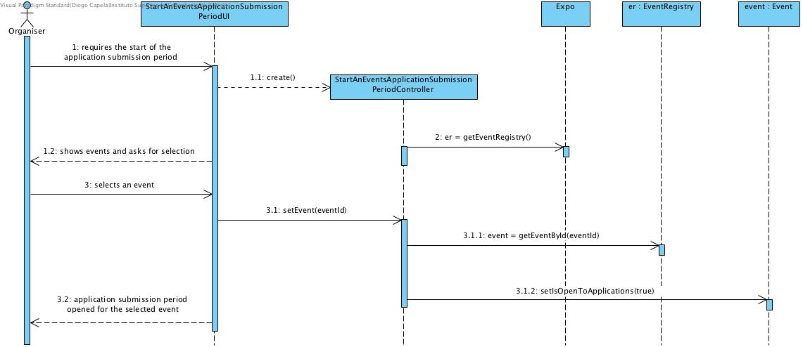
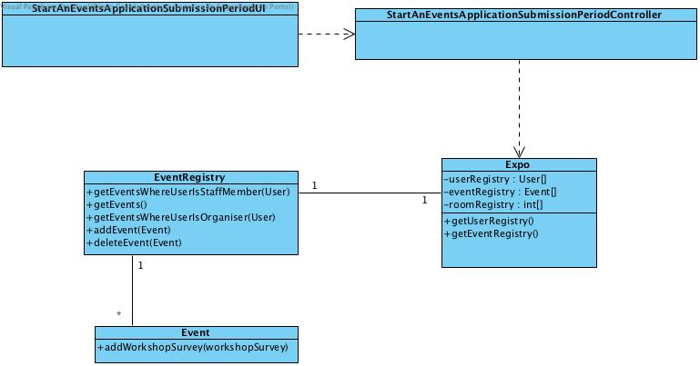

# **UC03 Start an Event's Application Submission Period**

## **1. Analysis**

### Brief Description

Applications are only possible for events with established organisers, event staff and application deadline. Applications’ submission period becomes open when organisers manually trigger it.

### Main Actor

Organizer

### System Sequence Diagram (SSD)

## **2. Design**

### Sequence Diagram

### Class Diagram

