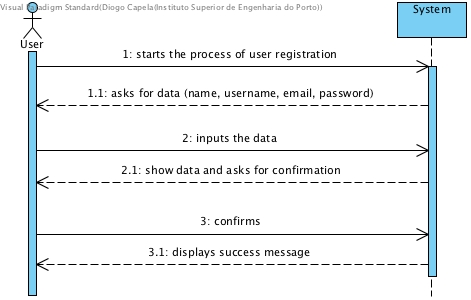
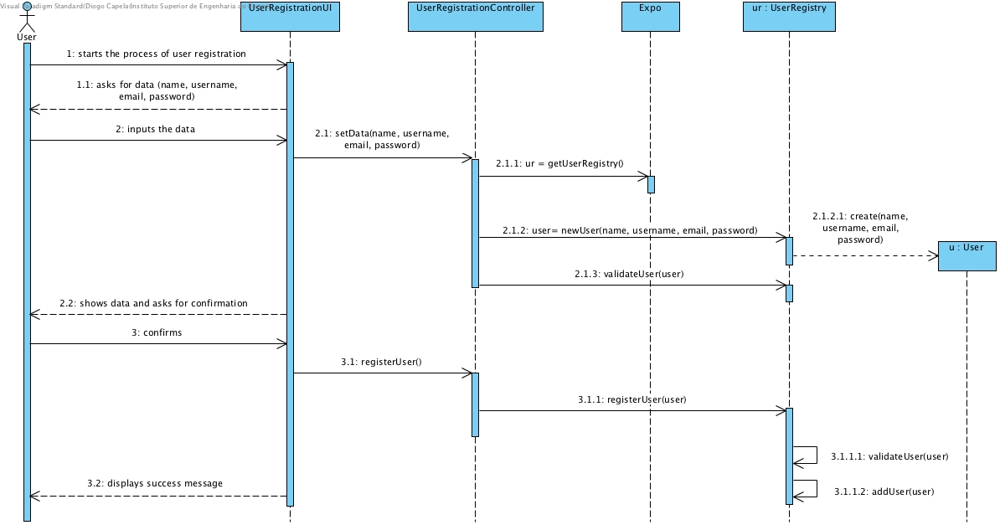
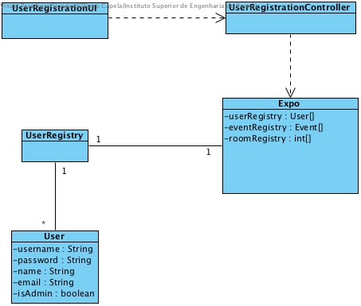

# **UC04 User Registration**

## **1. Analysis**

### Brief Description

A user get registered within the Expo system. The user is prompted with a message to input his name, email address, username and password. The username and the email address must be unique within the system and the password must be at least 8 characters long, include a digit, include an upper and a lower-case character and include a punctuation mark (",", ".", ";", ":" or "-").
This is a creating of a regular user. It's permissions vary depending on the events (eg. he can be event manager on one event and a regular participant on another event).

### Main Actor

User

### System Sequence Diagram (SSD)

## **2. Design**

### Sequence Diagram

### Class Diagram

