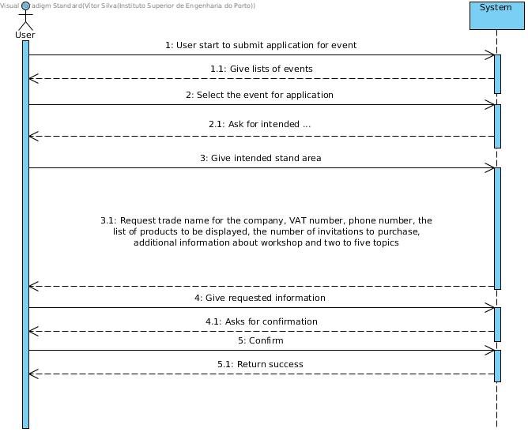
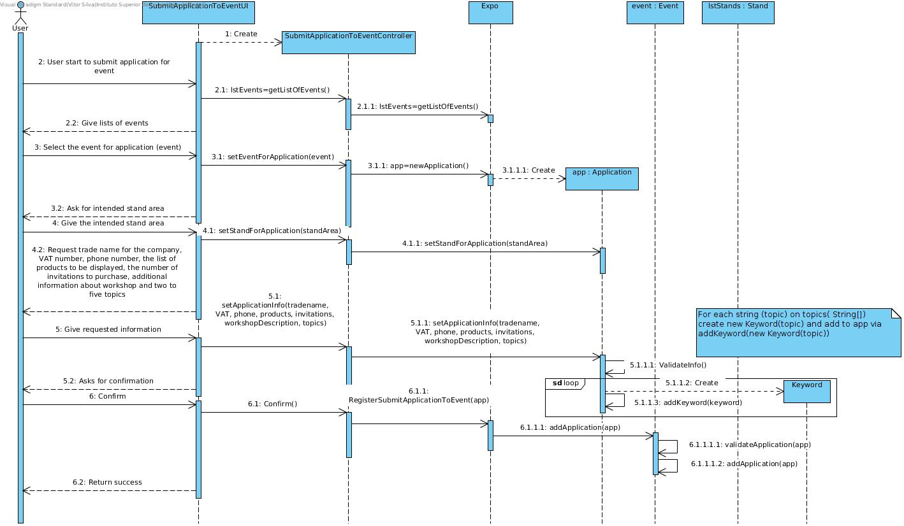
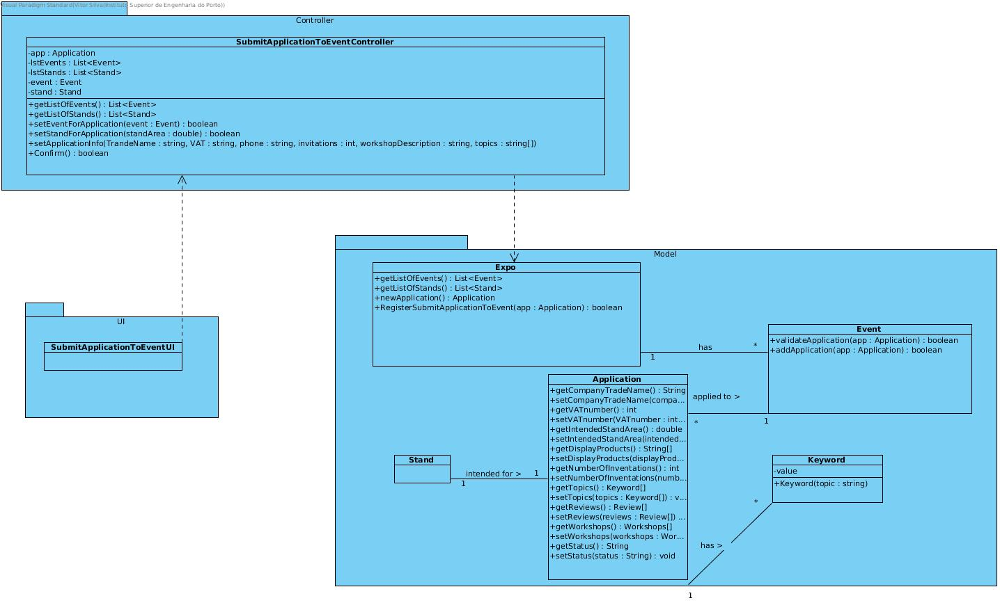

# **UC05 Submit Application to Event**

## **1. Analysis**

### Brief Description

An applicant's representative applies for an event. This is done by submiting an application to a specific event. This only possible for established organizers, event staff and application deadline. This user start the use case and system will give the list of events to apply. The user select one and system will ask for intended stand area. User fill the intended stand area, then system request for trade name for the company, VAT number, phone number, the list of products to be displayed, the number of invitations to purchase, adicional information about workshop that might take place and two to five topics. The system asks for confirmation and the user confirm.

### Main Actor

Applicant's representative

### System Sequence Diagram (SSD)

## **2. Design**

### Sequence Diagram

### Class Diagram

