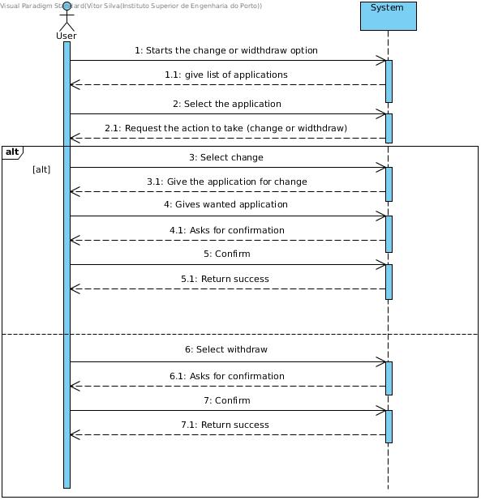
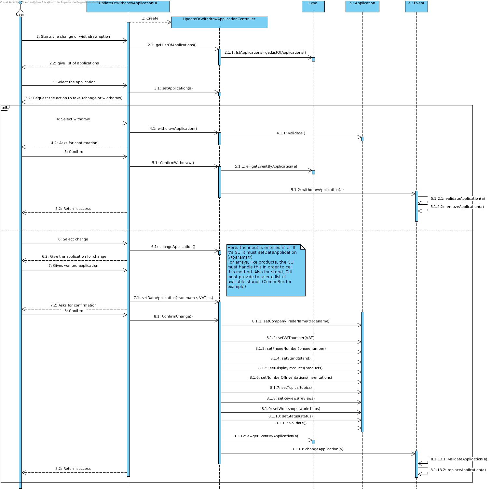
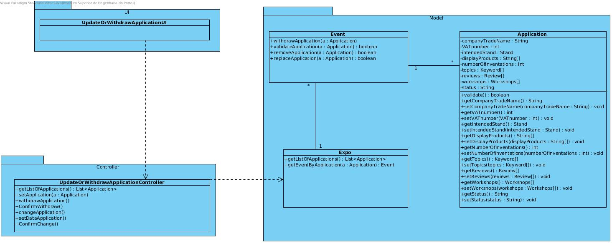

# **UC06 Update or Withdraw Application**

## **1. Analysis**

### Brief Description

The user can update or withdraw an application from an event. The system gives the user a list of applications. The user will select one and the system will ask what action the user wants (withdraw - removes or update - changes). This is an alternate. If the user selects update the system will give the application to the user and the user must return the new application (even if unchanged). The system will validate and replace the application on that event. The other options is widthdraw. For this system will ask for confirmation and after the user confirms, system will remove the application from the event applications list.

### Main Actor

User

### System Sequence Diagram (SSD)

## **2. Design**

### Sequence Diagram

### Class Diagram

