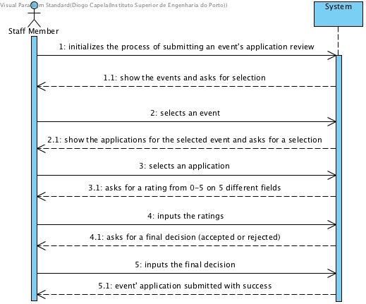

# **UC07 Submit Application Review**

## **1. Analysis**

### Brief Description

Organisers assign applications to staff members to be reviewed. This process is only possible after the applications’ submission deadline and can be achieved by importing a file with that data. Staff members are employees that later-on, in addition to other tasks, review event applications.

For each application, each staff member rates the application for different parameters and indicates if the application is accepted or rejected, along with a brief justification text. Furthermore, for each review, each staff member, should rate the following parameters:
- Staff member’s knowledge about the application: from 0 to 5
- Application adequacy for the event: from 0 to 5
- Invitations quantity adequacy for the application: from 0 to 5
- Requested stand area: from 0 to 5
- Overall recommendation: 0-5

### Main Actor

 Staff Member

### System Sequence Diagram (SSD)

## **2. Design**

### Sequence Diagram

### Class Diagram

