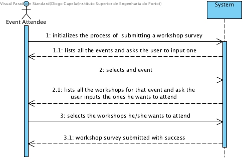
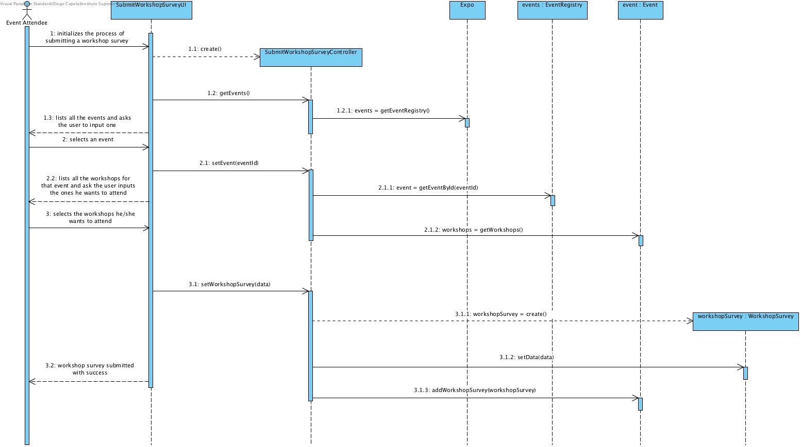
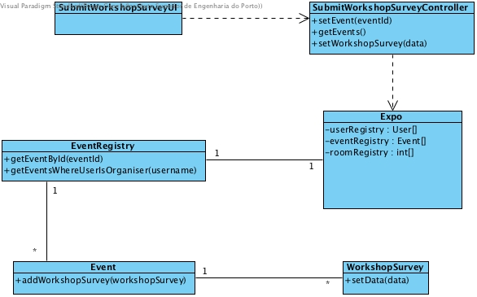

# **UC08 Submit Workshop Survey**

## **1. Analysis**

### Brief Description

There is a limited number of rooms for all workshops. For this reason, for event attendees to be able to attend most of the desired workshops, before setting up the final program, a survey is made where future attendees submit which workshops they wish to attend.
The system will ask for which event the attendee wants to submit the workshop survey and then will list all the workshops for that event, letting the attendee input the ones he or she wants to attend.

### Main Actor

General User / Event Attendee

### System Sequence Diagram (SSD)

## **2. Design**

### Sequence Diagram

### Class Diagram

