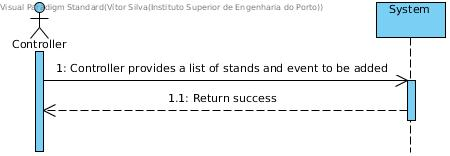
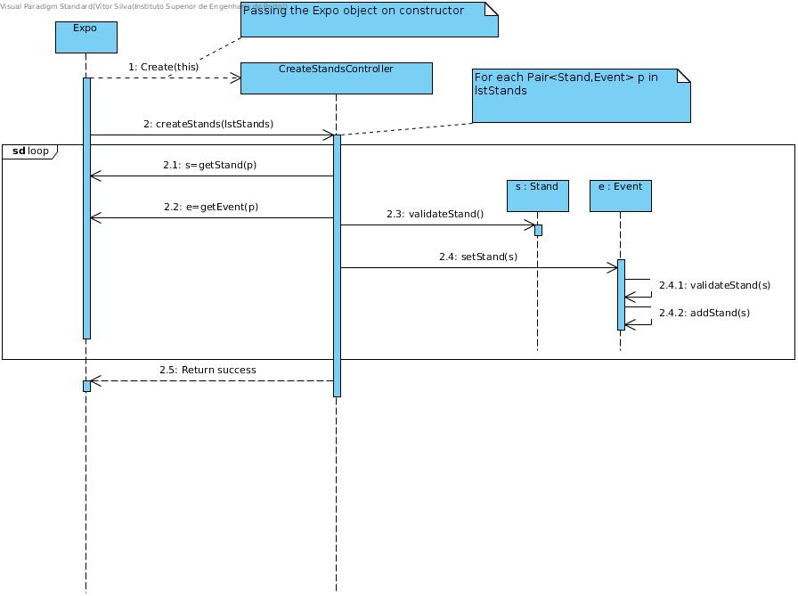
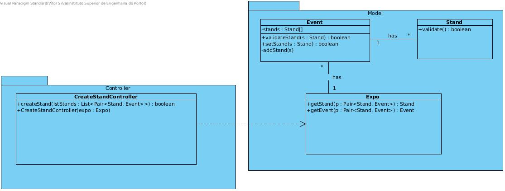

# **UC10 Create Stands**

## **1. Analysis**

### Brief Description

Expo has a capability to create a stand, like an internal 'API'. At any time, Expo can create a stand. So, it starts the use case. Expo creates a list of stands but it needs to specify what event to assign. So, a list of a linked pair Stand and Event is provided. The list can be only 1 (one) pair element.

### Main Actor

Controller/Expo

### System Sequence Diagram (SSD)

## **2. Design**

### Sequence Diagram

### Class Diagram

