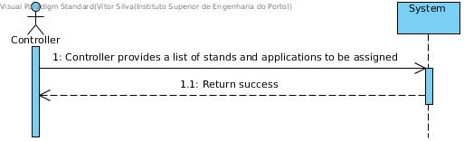
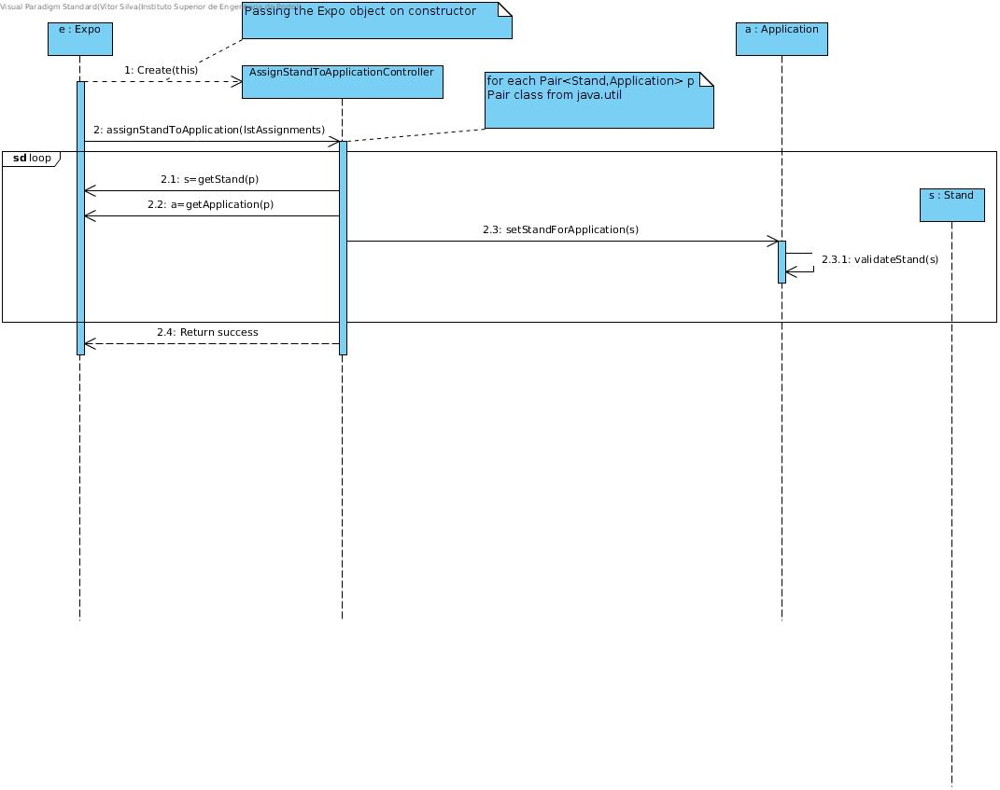
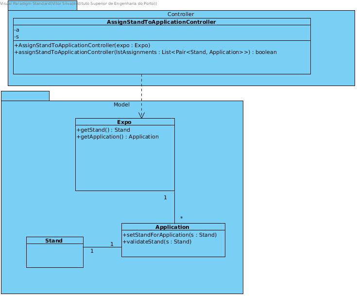

# **UC11 Assign Stand to Application**

## **1. Analysis**

### Brief Description

Expo has a capability to assign a stand to an application, like an internal 'API'. At any time, Expo can do this assignment. So, it starts the use case. Expo creates a list of stand and application Pair elements. The list of a linked pair Stand and Application is provided. The list can be only 1 (one) pair element. The controller returns success after the assignment.

### Main Actor

Event Manager / Organizer

### System Sequence Diagram (SSD)

## **2. Design**

### Sequence Diagram

### Class Diagram

