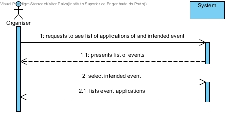
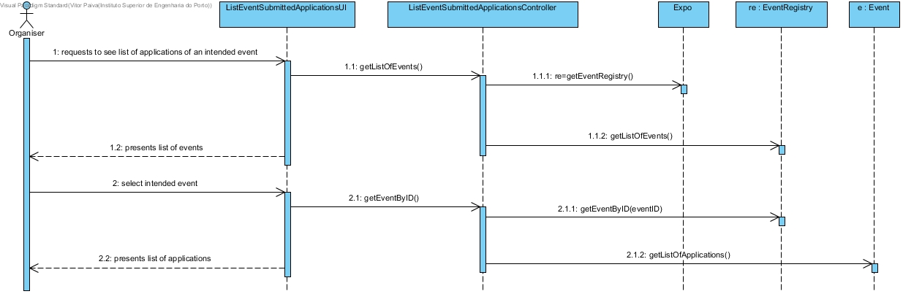
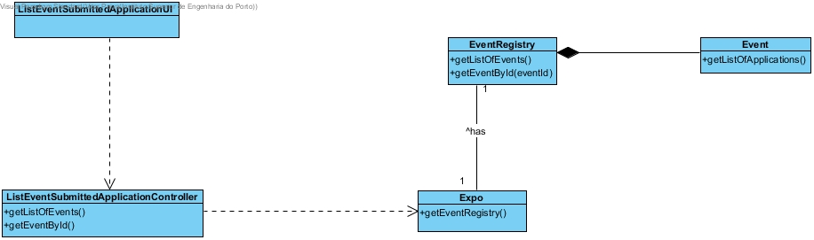

# **UC12 List an Event's Submitted Applications**

## **1. Analysis**

### Brief Description

The Organiser requests the list of registered applications of an intended event. The system presents the list of the registered events. The Organiser selects the intended event. The system presents the list of that event's applications.

### Main Actor

Organiser

### System Sequence Diagram (SSD)

## **2. Design**

### Sequence Diagram

### Class Diagram

