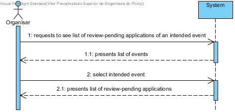
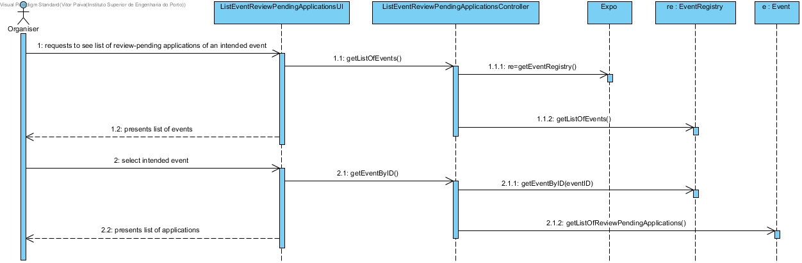
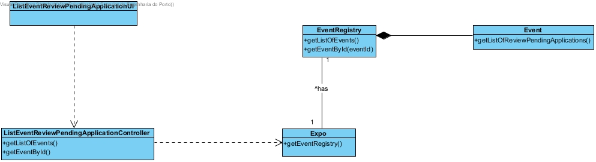

# **UC13 List an Event's Review-Pending Applications**

## **1. Analysis**

### Brief Description

The Organiser requests the list of review-pending applications of an intended event. The system presents the list of the registed events. The Organiser selects the intended event. The system presents the list of review-pending applications of that event.

### Main Actor

Organiser

### System Sequence Diagram (SSD)

## **2. Design**

### Sequence Diagram

### Class Diagram

