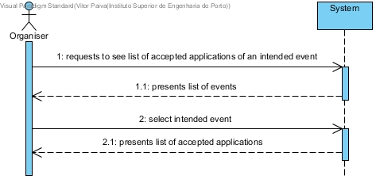
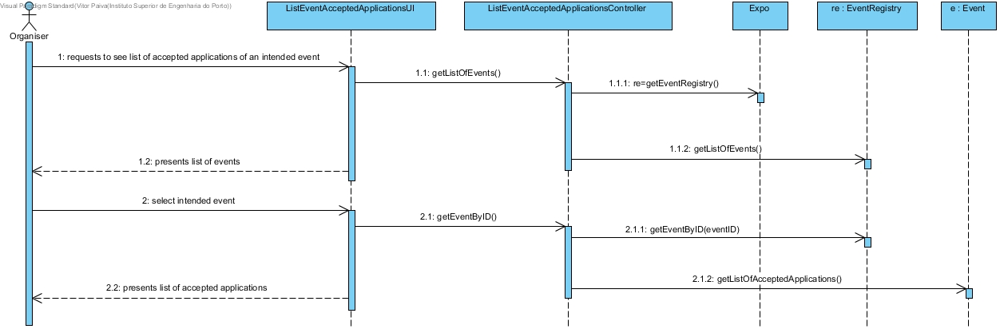
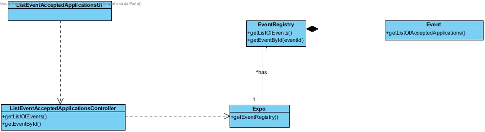

# **UC14 List an Event's Accepted Applications**

## **1. Analysis**

### Brief Description

The Organiser requests the list of accepted applications of an intended event. The system presents the list of the registed events. The Organiser selects the intended event. The system presents the list of accepted applications of that event.

### Main Actor

Organiser

### System Sequence Diagram (SSD)

## **2. Design**

### Sequence Diagram

### Class Diagram

