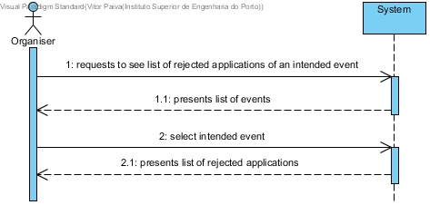
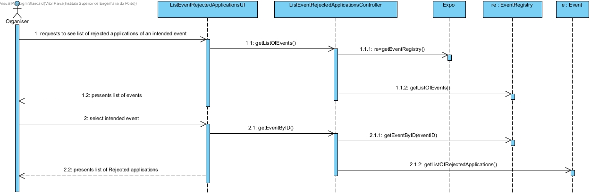
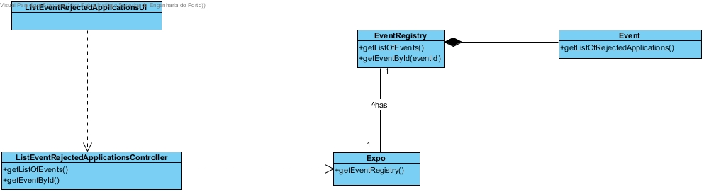

# **UC15 List an Event's Rejected Applications**

## **1. Analysis**

### Brief Description

The Organiser requests the list of rejected applications of an intended event. The system presents the list of the registed events. The Organiser selects the intended event. The system presents the list of rejected applications of that event.

### Main Actor

Organiser

### System Sequence Diagram (SSD)

## **2. Design**

### Sequence Diagram

### Class Diagram

