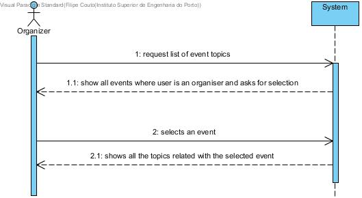
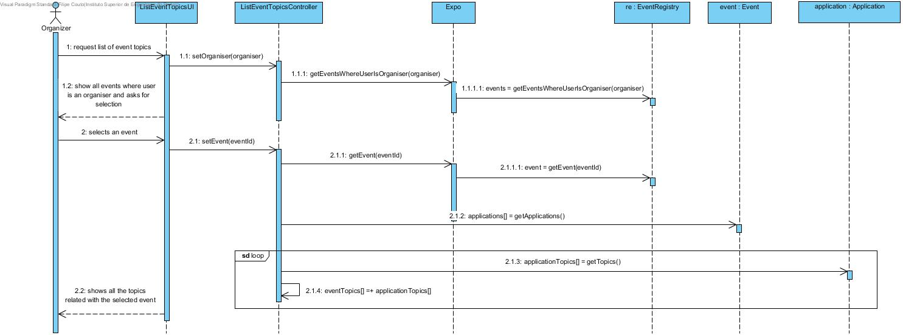
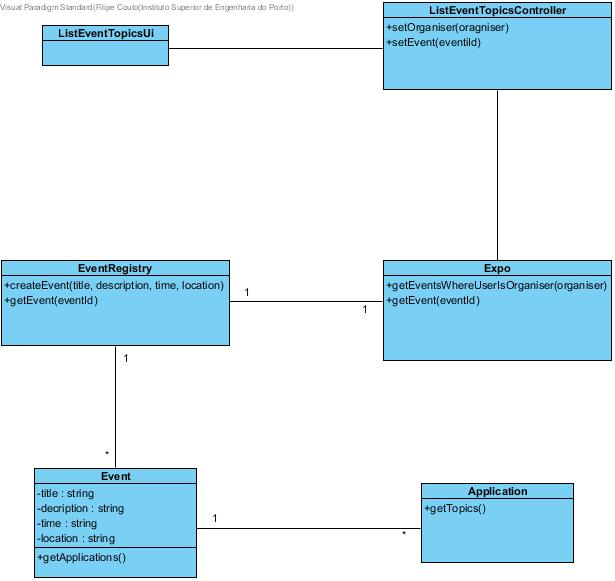

# **UC16 List Event Topics**

## **1. Analysis**

### Brief Description

Organisers want to be able to have information about which topics are in vogue. The organiser initializes the use case, the system asks for the specific event and, after selection, it prints all the topics related with all the applications from that event.

### Main Actor

Organiser

### System Sequence Diagram (SSD)

## **2. Design**

### Sequence Diagram

### Class Diagram

