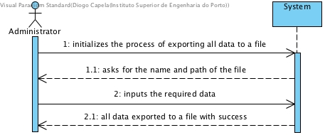
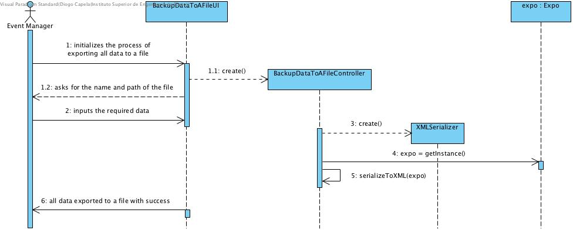
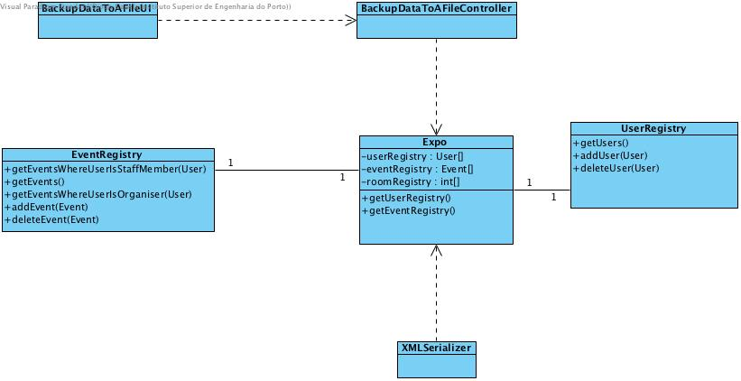

# **UC20 Backup Data to a File**

## **1. Analysis**

### Brief Description

The administrator exports all the data from the current state of the system to an external XML formatted file.

### Main Actor

Administrator

### System Sequence Diagram (SSD)

## **2. Design**

### Sequence Diagram

### Class Diagram

