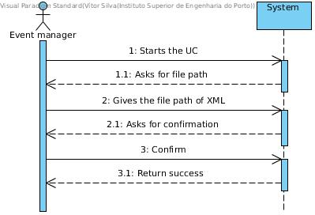
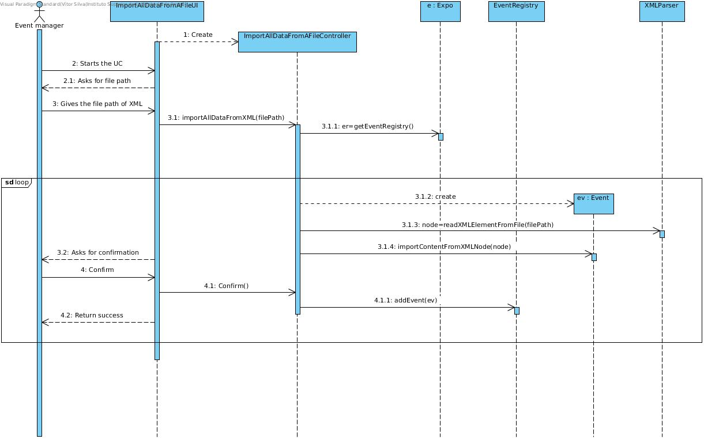
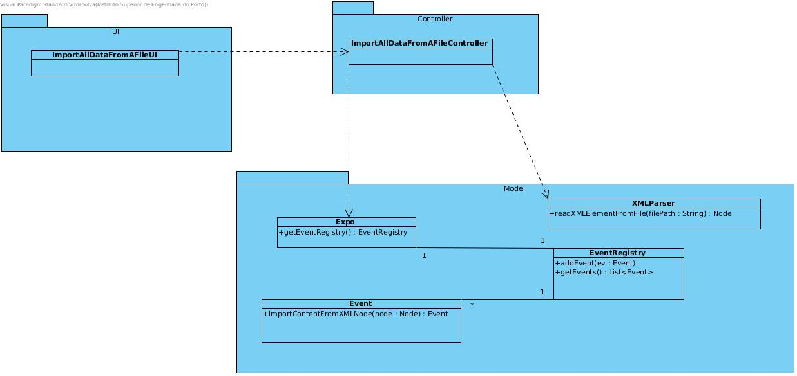

# **UC21 Import Backup from a File**

## **1. Analysis**

### Brief Description

Event manager starts this use case by selecting a XML file to import all data. The system will parse the information ask for confirmations. Event manager confirms. Data is appended to the application.

### Main Actor

Event manager

### System Sequence Diagram (SSD)

## **2. Design**

### Sequence Diagram

### Class Diagram

