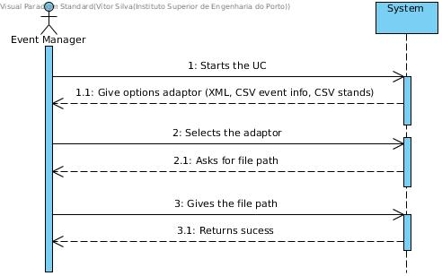
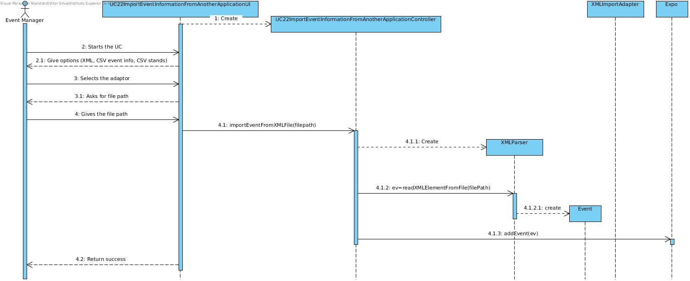
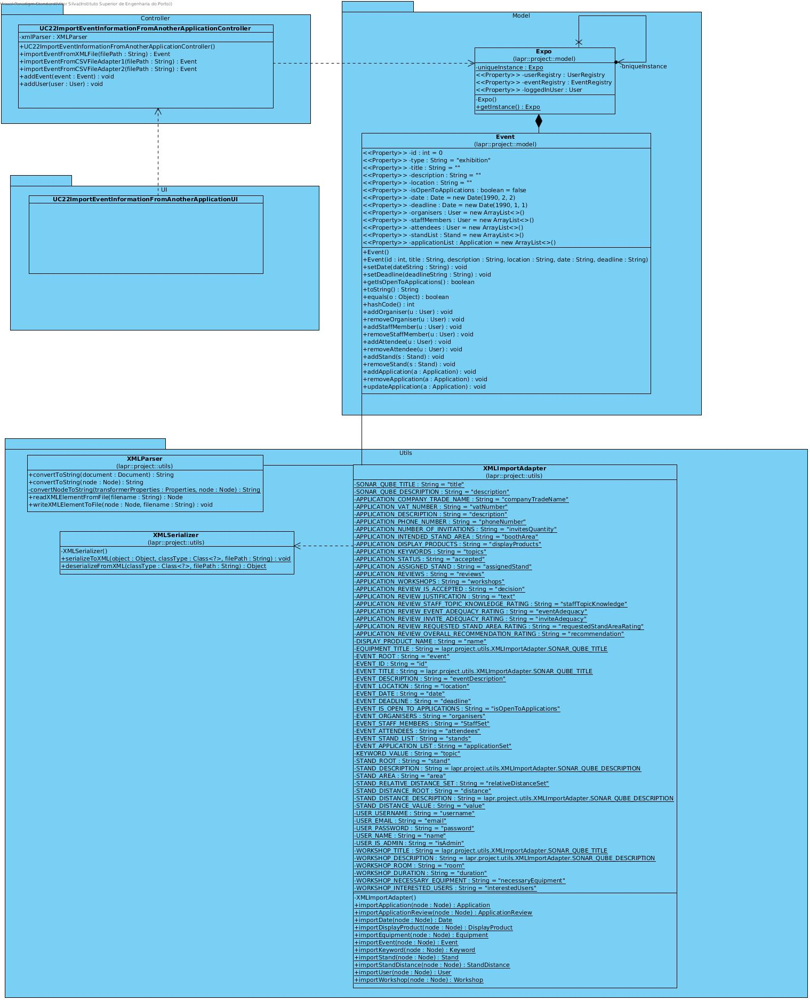

# **UC22 Import Event Information from Another Software**

## **1. Analysis**

### Brief Description

A backup file was provided by the client and needs to be address by the current software solution. The 2 formats is in 'CSV' semicolon (For Event Information and other for stand Information) separated and 'XML' format.
An adaptor for XML handle this importation. The Event Manager start the use case by selecting one of 3 options: XML import, CSV event information import or CSV event stands import. The adaptor will handle the parsing part and return a list of events.  

### Main Actor

Event Manager

### System Sequence Diagram (SSD)

## **2. Design**

### Sequence Diagram

### Class Diagram

