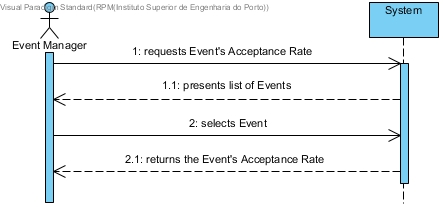
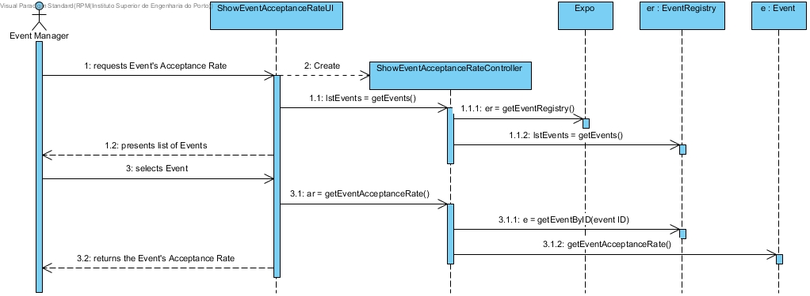
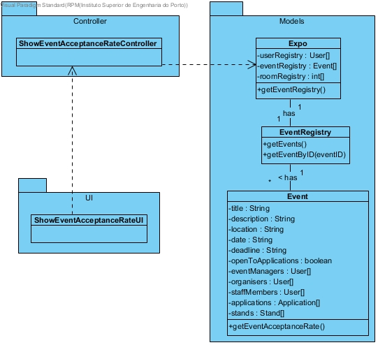

# **UC30 Show Event Acceptance Rate**

## **1. Analysis**

### Brief Description

Event Manager requests Event's Acceptance Rate. System presents list of Events. Event Manager selects Event. System returns the Event's Acceptance Rate.

### Main Actor

Event Manager

### System Sequence Diagram (SSD)

## **2. Design**

### Sequence Diagram

### Class Diagram

