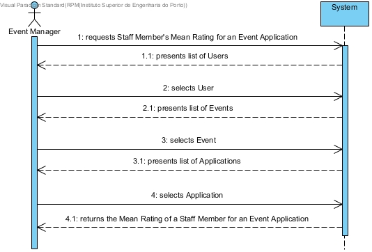
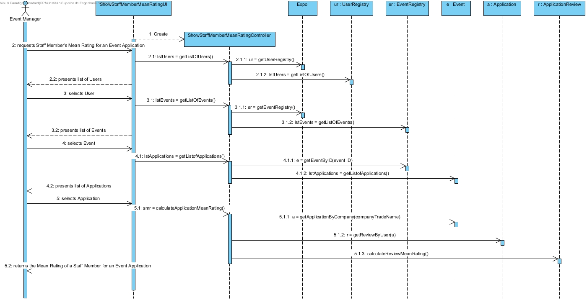
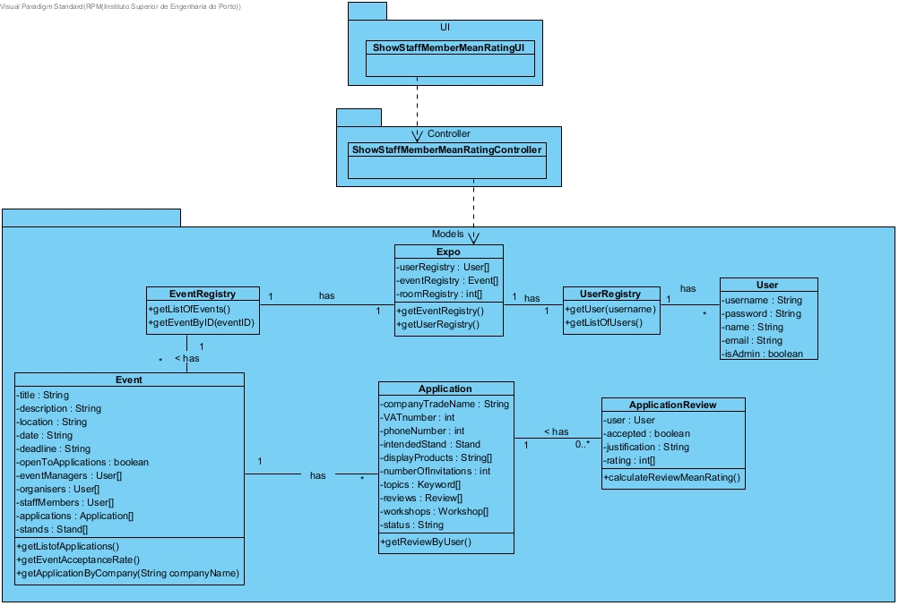

# **UC31 Show a Staff Member Mean Rating**

## **1. Analysis**

### Brief Description

Event Manager requests Staff Member's Mean Rating for a given Event Application. System presents list of Users. The Event Manager selects User. System presents list of Events. The Event Manager selects Event. System presents list of Applications. The Event Manager selects Application. The System returns the Mean Rating of a Staff Member for a given Event Application

### Main Actor

Event Manager

### System Sequence Diagram (SSD)

## **2. Design**

### Sequence Diagram

### Class Diagram

