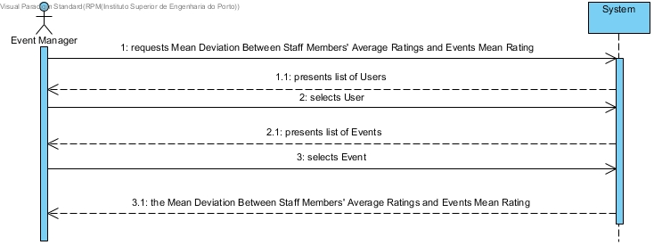
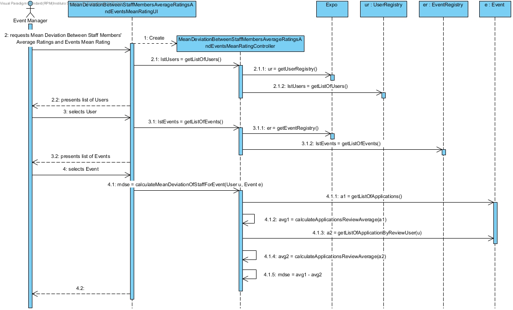
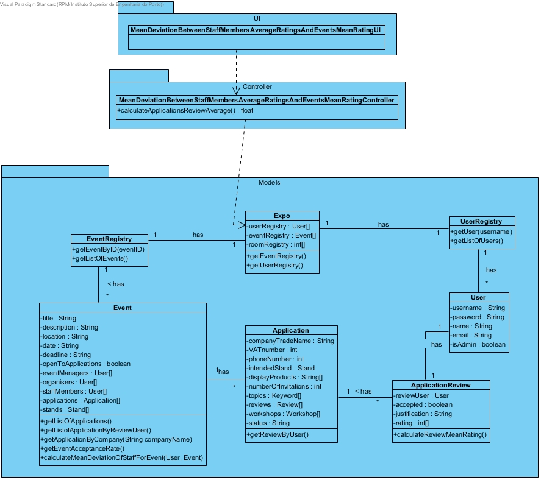

# **UC32 Show the Mean Deviation Between Staff Members' Average Ratings and Events Mean Rating**

## **1. Analysis**

### Brief Description

Event Manager requests Mean Deviation Between Staff Members' Average Ratings and Events Mean Rating. System presents list of Events. System presents list of Users. The Event Manager selects User. Event Manager selects Event. System returns the Mean Deviation Between Staff Members' Average Ratings and Events Mean Rating.

### Main Actor

Event Manager

### System Sequence Diagram (SSD)

## **2. Design**

### Sequence Diagram

### Class Diagram

