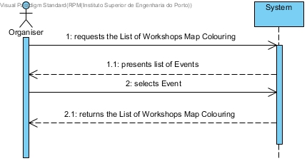
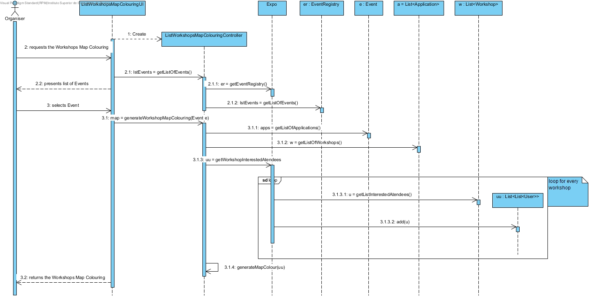
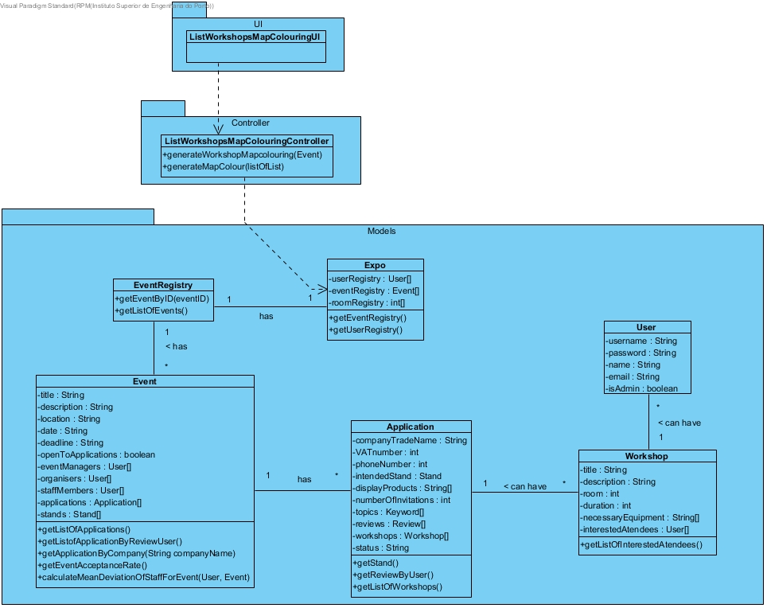

# **UC33 List Workshops Map Colouring**

## **1. Analysis**

### Brief Description

Organiser requests the Workshops Map Colouring. System presents list of Events. Organiser selects Event. System returns the Map Colouring of Workshops for the Event.

### Main Actor

User (Event Manager / Organizer)

### System Sequence Diagram (SSD)

## **2. Design**

### Sequence Diagram

### Class Diagram

