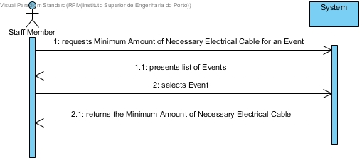

# **UC34 Calculate Minimum Amount of Necessary Electrical Cable**

## **1. Analysis**

### Brief Description

Staff Member requests the Minimum Amount of Necessary Electrical Cable for an Event. System presents list of Events. Staff Member selects Event. System returns the Minimum Amount of Necessary Electrical Cable for an Event.

### Main Actor

User (Event Manager / Organiser / Staff)

### System Sequence Diagram (SSD)

## **2. Design**

### Sequence Diagram

### Class Diagram

