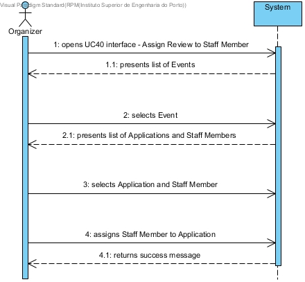
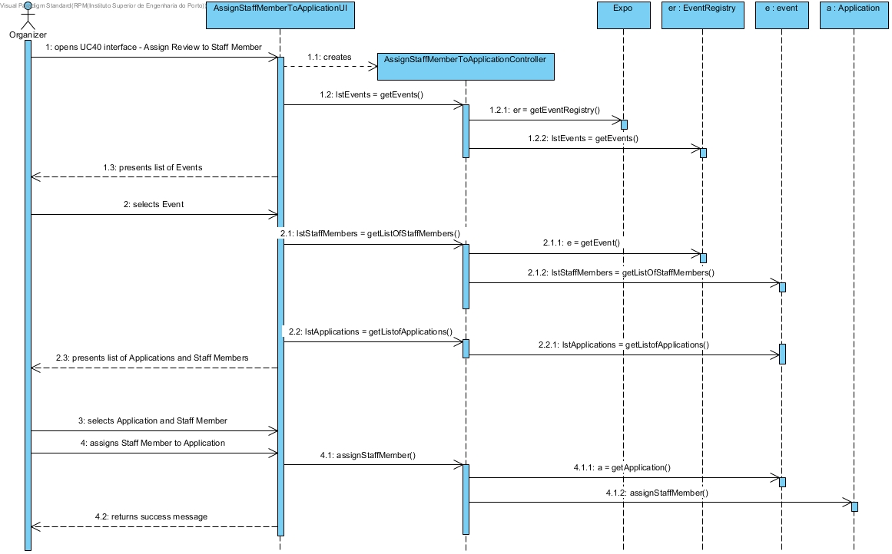
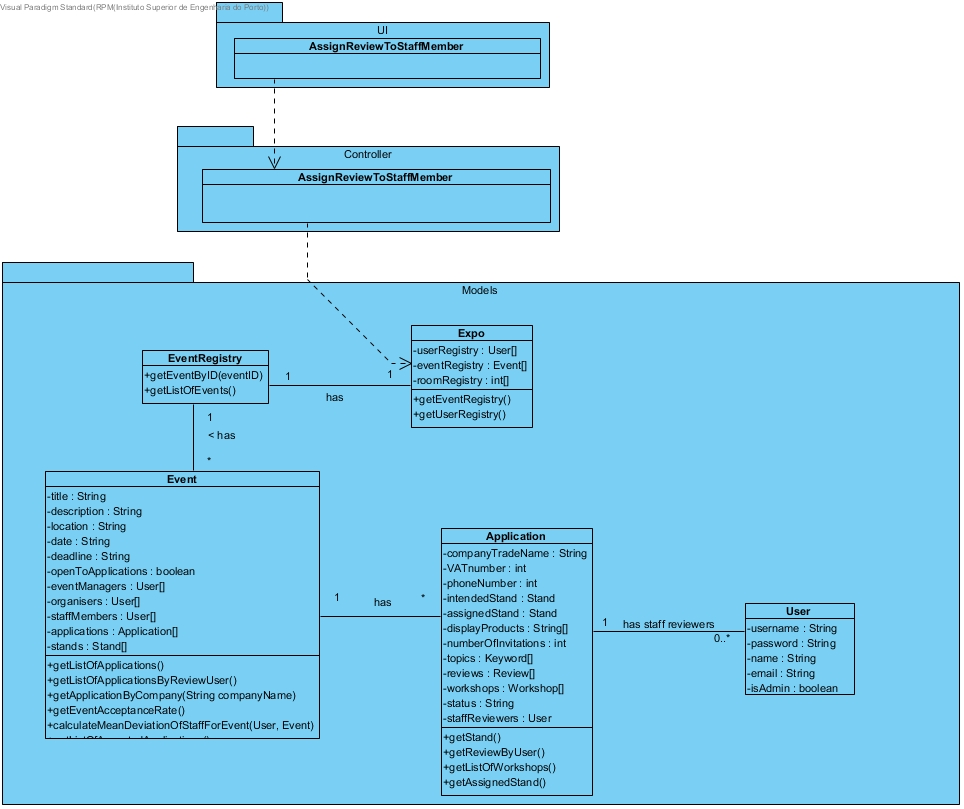

# **UC40 Assign Review to Staff Member**

## **1. Analysis**

### Brief Description

The Organizer opens the UC40 interface. The System presents the list of Events. The Organizer selects the Event. The System displays the list of Applications and Staff Members in the previously selected Event. The Organizer selects an Application and a Staff Member. The Organizer then requests to assign the Staff Member to the Application. The System returns a success message.

### Main Actor

Organizer

### System Sequence Diagram (SSD)

## **2. Design**

### Sequence Diagram

### Class Diagram

