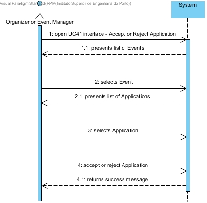
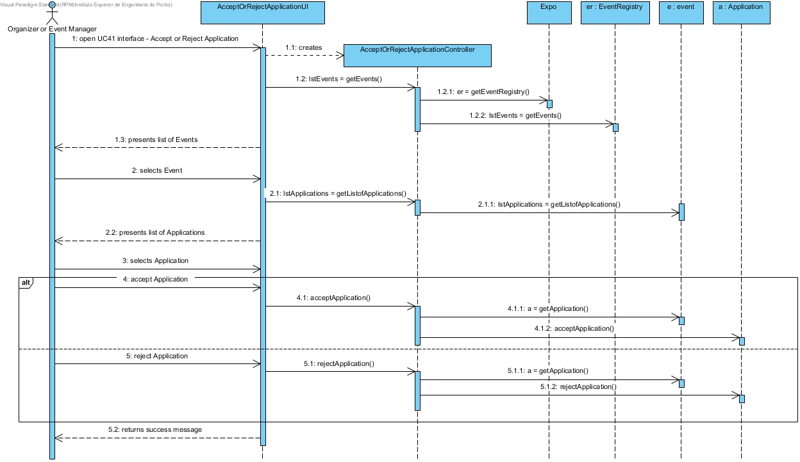
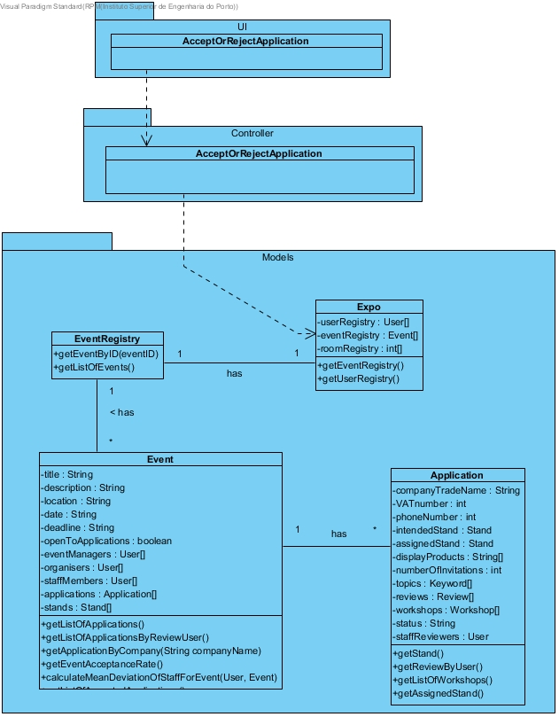

# **UC41 Accept or Reject Application**

## **1. Analysis**

### Brief Description

Organizer or Event Manager opens the UC41 interface. The System presents the list of Events. The Organizer or Event Manager selects the Event. The System displays the list of Applications in the previously selected Event. The Organizer or Event Manager selects an Application. The Organizer or Event Manager accepts or rejects the selected Application.

### Main Actor

Organizer or Event Manager

### System Sequence Diagram (SSD)

## **2. Design**

### Sequence Diagram

### Class Diagram

